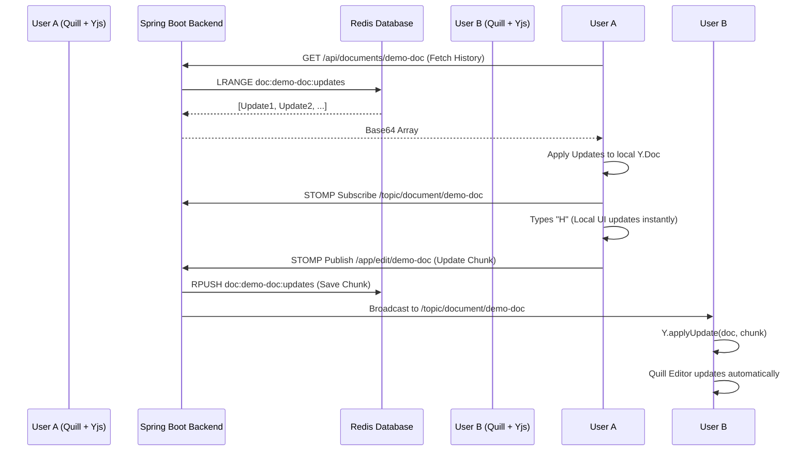

# Collaborative Document Editor

A real-time, high-concurrency collaborative editing system built with React, Spring Boot, STOMP WebSockets, Redis, and CRDTs (Conflict-free Replicated Data Types) via Yjs.

## 🌊 Application Flow

The architecture of this Collaborative Document Editor relies heavily on **CRDTs** to handle the complexity of merging simultaneous edits, and uses **WebSockets** for low-latency communication.

Here is the step-by-step flow of what happens from the moment a user opens the app to the moment they collaborate with someone else:

### 1. The Initialization Flow (Joining a Document)
When User A opens the browser and loads a document (e.g., `demo-doc`):
1. **Frontend Init**: The React app mounts `CollabEditor` and creates an empty Yjs CRDT Document (`new Y.Doc()`).
2. **REST Fetch**: Before connecting to WebSockets, the frontend makes an HTTP GET request to the Spring Boot backend (`/api/documents/demo-doc`).
3. **Redis Read**: The backend queries Redis for the list `doc:demo-doc:updates`, which contains all historical edits ever made to this document.
4. **State Reconstruction**: The backend sends these binary chunks (encoded as Base64) back to the frontend. The frontend applies them sequentially using `Y.applyUpdate(doc, update)`. User A now sees the current state of the document.

### 2. The Live Connection Flow
Once the initial state is loaded:
1. **WebSocket Connect**: The frontend uses `SockJS` and `STOMP` to open a persistent WebSocket connection to the Spring Boot backend (`/ws-collab`).
2. **Topic Subscription**: User A subscribes to the STOMP topic `/topic/document/demo-doc`. They are now listening for any live edits made by other users.

### 3. The Editing Flow (Typing)
When User A types the letter "H" into the Quill editor:
1. **Local Update**: The `y-quill` binding immediately detects the change in the Quill editor and updates the local Yjs CRDT engine. The letter appears on screen instantly (zero latency).
2. **CRDT Generation**: Yjs generates a small, mathematically unique binary "update chunk". This chunk represents "Insert 'H' at index 5" and is tagged with User A's unique CRDT identifier.
3. **Transmission**: Our `useCollabSync` hook converts this binary chunk to Base64 and publishes a STOMP message to the backend endpoint `/app/edit/demo-doc`.

### 4. The Backend Flow (Relay & Store)
When the Spring Boot backend receives User A's STOMP message:
1. **Persistence**: The `EditorController` intercepts the message and passes it to the `DocumentService`.
2. **Hot Storage**: The `DocumentService` pushes the Base64 update string onto the right side of the Redis List `doc:demo-doc:updates`. This ensures that if User C joins 10 seconds later, they will get this new edit during their Initialization Flow.
3. **Broadcasting**: The `@SendTo` annotation on the controller automatically broadcasts the message to everyone subscribed to `/topic/document/demo-doc` (e.g., User B).

### 5. The Remote Merging Flow
When User B (who is also subscribed to the topic) receives the broadcasted message:
1. **Decoding**: User B's frontend receives the JSON message, ignores it if it was sent by themselves, and decodes the Base64 string back into a `Uint8Array`.
2. **CRDT Merging**: User B passes the binary chunk into their local Yjs engine via `Y.applyUpdate(doc, remoteUpdate)`.
3. **Conflict Resolution**: *This is where the magic happens.* If User B was simultaneously typing something else, the Yjs CRDT engine uses the unique identifiers in the update chunk to deterministically figure out exactly where the "H" should go. It resolves the conflict mathematically.
4. **UI Update**: `y-quill` automatically reflects the merged Yjs state back into User B's Quill editor.

---

## 📊 Visualizing the Flow



Because of this architecture, the backend never has to parse HTML, manage cursors, or resolve text conflicts. It acts purely as a high-speed router and storage layer for binary CRDT updates, making the system incredibly scalable!

## 🚀 How to Run

1. **Start Redis**:
   ```bash
   docker-compose up -d
   ```
2. **Start Backend (Spring Boot)**:
   ```bash
   mvn spring-boot:run
   ```
3. **Start Frontend (Vite/React)**:
   ```bash
   cd frontend
   npm run dev
   ```
4. **Test**: Open `http://localhost:5173` in multiple browser windows to test the real-time sync.
