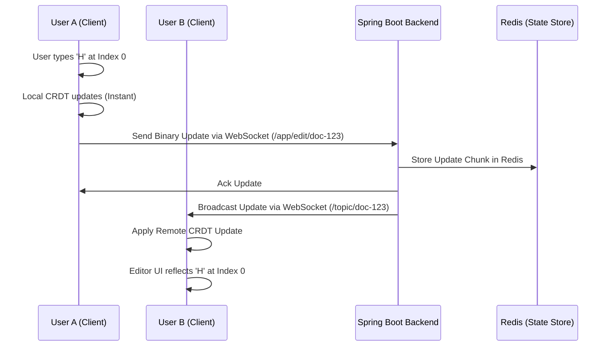

# Collaborative Document Editor: System Design & Flow

A real-time, high-concurrency collaborative editing system designed to handle multiple simultaneous users without data loss or conflicts.

## 🚀 The Challenge: Real-Time Synchronization
When multiple users edit a single document, the system must ensure that:
1.  **Low Latency**: Edits appear on other screens in milliseconds.
2.  **Concurrency Control**: If two people type at the same index simultaneously, the system must resolve the order deterministically.
3.  **Eventual Consistency**: Once all updates are processed, every user must see the exact same document.

---

## 🏗️ Architectural Components

### 1. The CRDT Engine (Conflict-free Replicated Data Types)
Instead of a central server "locking" the document, we use **CRDTs**. Every character in the document is assigned a unique, globally sortable identifier. 
*   **Merge Logic**: When two operations arrive, the CRDT engine uses the unique IDs to determine their position, ensuring the result is always identical on all machines.

### 2. The Communication Layer (WebSockets + STOMP)
*   **Protocol**: WebSockets provide a full-duplex persistent connection.
*   **Signaling**: We use the **STOMP** (Simple Text Oriented Messaging Protocol) on top of WebSockets to manage "Topics" (one per document).

### 3. The Backend (Spring Boot)
*   **Role**: The backend acts as a high-speed "message relay" and "state store." It doesn't necessarily need to understand the rich-text content; it just propagates binary update chunks between clients.

### 4. High-Speed Storage (Redis)
*   **Role**: Redis acts as the "Hot Store." It keeps the latest document snapshots and a log of recent operations for fast synchronization when a new user joins a session.

---

## 🌊 Complete Application Flow

### 1. Local Edit (Optimistic UI)
When a user types, the local editor (React + Quill) immediately updates the screen. The Yjs engine generates a small binary "update" containing the change and its unique CRDT ID.

### 2. Propagation
The update is sent to the Spring Boot `/app/edit/{docId}` endpoint. The backend immediately pushes this message to the `/topic/{docId}` channel where all other collaborators are listening.

### 3. Remote Merging
Other users receive the update and feed it into their local CRDT engine. The engine automatically merges the change at the correct position, even if that user was typing elsewhere in the document at the same time.

### 4. Persistence & Snapshots
To prevent loading thousands of individual character updates when a user joins, the backend periodically "compresses" the updates into a single **Document Snapshot** in Redis.

---

## 🛠️ Troubleshooting & Edge Cases
*   **Offline Support**: If a user loses connection, the CRDT engine keeps track of local changes and "syncs" them the moment the WebSocket reconnects.
*   **Cursor Tracking**: We use a separate WebSocket topic to share the selection range (index) of each user, allowing us to render colored cursors for other collaborators.
