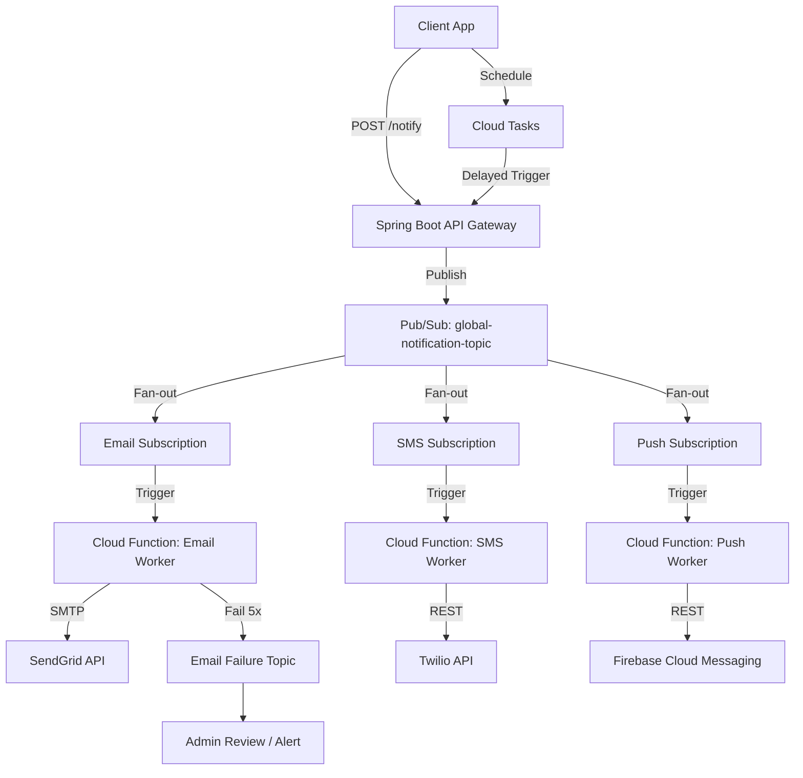

# Global Notification Engine (Distributed & Reliable)

A production-grade, message-driven notification system designed to handle high-volume traffic across multiple channels (Email, SMS, Push) with 99.9% reliability.

---

## 🏗️ Architecture Overview

The system uses a **Pub/Sub Fan-out** pattern to ensure that a single notification request can be delivered across multiple channels independently and reliably.



---

## 💎 Key Design Patterns

### 1. Pub/Sub Fan-out
Instead of the API calling three different services sequentially (which is slow and fragile), it publishes **one message** to a topic. Pub/Sub then "fans out" that message to all active listeners. This makes adding a new channel (like WhatsApp or Slack) as easy as adding a new subscription.

### 2. Message Durability & Retries
By using Pub/Sub, we ensure that if a worker (Cloud Function) is down, the message stays in the queue until the worker is back online. We've configured **Exponential Backoff** to handle temporary API rate limits.

### 3. Dead Letter Queues (DLQ)
For critical failures (e.g., an invalid email address or expired API key), we don't want to retry forever. After 5 failed attempts, the message is moved to a **Failure Topic** for manual inspection and audit.

### 4. Delayed Execution (Cloud Tasks)
For use cases like "Send a reminder in 1 hour," we use **Google Cloud Tasks**. It acts as a distributed scheduler that "calls back" our API at the exact timestamp requested.

---

## 🛠️ Tech Stack
- **API Gateway:** Java 21 + Spring Boot 3.2
- **Message Broker:** Google Cloud Pub/Sub
- **Serverless Workers:** Python 3.10 Cloud Functions (Gen 2)
- **Scheduling:** Google Cloud Tasks
- **Integrations:** SendGrid (Email), Twilio (SMS), FCM (Push Notifications)

---

## 📂 Project Structure
```text
Distributed-Notification-Service/
├── notification-gateway/    # Spring Boot API
├── cloud-functions/         # Channel Workers (Python)
│   ├── email-worker/
│   ├── sms-worker/
│   └── push-worker/
└── infrastructure/          # Terraform/Scripts (Optional)
```
