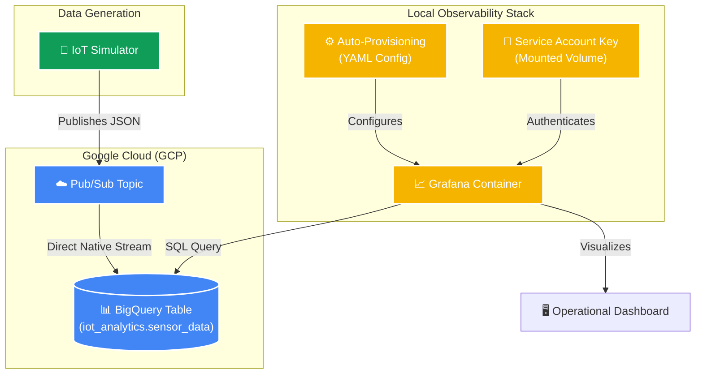

# 📊 Enterprise Observability: Grafana & BigQuery

This document outlines the system design for the "Enterprise Grade" observability layer added to the IoT Telemetry project.

## 🏗️ Architecture Overview

The observability layer is designed to be fully automated and decoupled from the real-time ingestion path. While Cassandra handles the live API data, Grafana uses Google BigQuery to provide high-level analytical dashboards.



## 🛠️ Design Patterns

### 1. Infrastructure as Code (IaC)
Instead of manually adding a data source in the Grafana UI, we use **Provisioning**.
*   **File:** `grafana/provisioning/datasources/bigquery.yml`
*   **Benefit:** The dashboard is portable. You can delete the container and spin it back up, and your BigQuery connection will be alive instantly without manual clicks.

### 2. Secret Mounting (Security)
We do not hardcode the GCP credentials into the image.
*   **Pattern:** We mount the host's `.json` key into the container at `/etc/gcp/credentials:ro`.
*   **Benefit:** Keeps sensitive keys out of version control while allowing the container to authenticate securely.

### 3. BigQuery Direct-to-Sink
The Grafana dashboard bypasses the Spring Boot backend entirely.
*   **Pattern:** Direct analytical querying.
*   **Benefit:** Zero impact on the performance of your production Java API. Even if 100 people are viewing the dashboard, your real-time sensor ingestion into Cassandra remains unaffected.

## 🚀 How to build the Dashboard

1.  Login to `http://localhost:3000` (**admin / admin**).
2.  Go to **Dashboards** -> **New Dashboard**.
3.  Add a **Visualization** and select the **BigQuery** data source (pre-configured).
4.  Use a query like this for a real-time graph:
    ```sql
    SELECT
      recordedAt AS time,
      temperature,
      sensorId
    FROM `homegenie-prod.iot_analytics.sensor_data`
    WHERE $__timeFilter(recordedAt)
    ORDER BY recordedAt ASC
    ```
