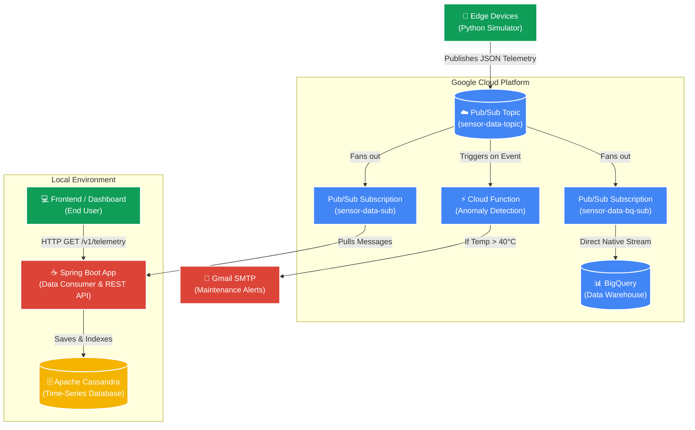

# 🛰️ Enterprise IoT Telemetry Pipeline

This project demonstrates a highly scalable, real-world "Fan-Out" architecture for an IoT telemetry ingestion pipeline. It simulates thousands of IoT sensors pushing data concurrently, buffers the traffic using Google Cloud Pub/Sub, and processes the data simultaneously across three parallel downstream systems.

## 🏗️ Architecture



## 🧠 Core Components

### 1. Data Generation (The "Edge")
- **`simulator.py`**: A Python script running in Docker that simulates IoT devices. It continuously generates JSON payloads containing `temperature`, `humidity`, `pressure`, and `batteryLevel` and publishes them to GCP Pub/Sub.

### 2. The Buffer (Google Cloud Pub/Sub)
- **`sensor-data-topic`**: Acts as a massive shock absorber. It receives the incoming data spikes and safely buffers them, enabling a "Fan-Out" architecture where one message is processed by multiple independent systems.

### 3. Path A: Real-Time API (Spring Boot + Cassandra)
- **Spring Boot Consumer**: Constantly listens to the `sensor-data-sub` subscription.
- **Apache Cassandra**: A Wide-Column Store optimized for heavy time-series writes. Data is stored using the "Bucket Pattern" (`PRIMARY KEY ((sensor_id, day_bucket), recorded_at)`) for lightning-fast retrieval of live dashboard data.
- **REST APIs**: Provides live endpoints like `/v1/telemetry/{sensorId}/latest` to query the Cassandra data.

### 4. Path B: The Data Warehouse (BigQuery)
- **Pub/Sub to BigQuery**: A native, zero-code subscription (`sensor-data-bq-sub`) streams exact copies of the messages directly into a BigQuery table (`iot_analytics.sensor_data`). 
- Optimized for Data Scientists to run complex SQL aggregations over years of historical data.

### 5. Path C: Real-Time Alerting (Cloud Functions)
- **Event-Driven Serverless**: A Python Cloud Function (`cloud-function/main.py`) that spins up instantly when a message hits the topic.
- It scans the JSON payload in real-time and uses Gmail SMTP to fire off an emergency email alert if critical thresholds are breached (e.g., Temp > 40°C).

---

## 🛠️ Prerequisites
- [Docker](https://www.docker.com/) & Docker Compose
- Java 17+ & Maven
- A Google Cloud Platform (GCP) Project
- GCP Service Account JSON Key (with Pub/Sub Subscriber/Publisher permissions)

## 🚀 How to Run Locally

### 1. Start Local Infrastructure
Start the Apache Cassandra database using Docker Compose:
```bash
docker-compose up -d cassandra
```

### 2. Configure GCP Credentials
Ensure your Service Account JSON key is available and its path is correctly updated in `backend/src/main/resources/application.yml` and `simulator.py`.

### 3. Start the Backend API
Navigate to the `backend` folder and start the Spring Boot application:
```bash
cd backend
./mvnw spring-boot:run
```

### 4. Start the IoT Simulator
In a new terminal, start the Python simulator via Docker:
```bash
docker-compose run simulator
```

### 5. Test the APIs
While the simulator is running, fetch the latest data for a specific sensor:
```bash
curl http://localhost:8080/v1/telemetry/sensor-A1/latest
```
