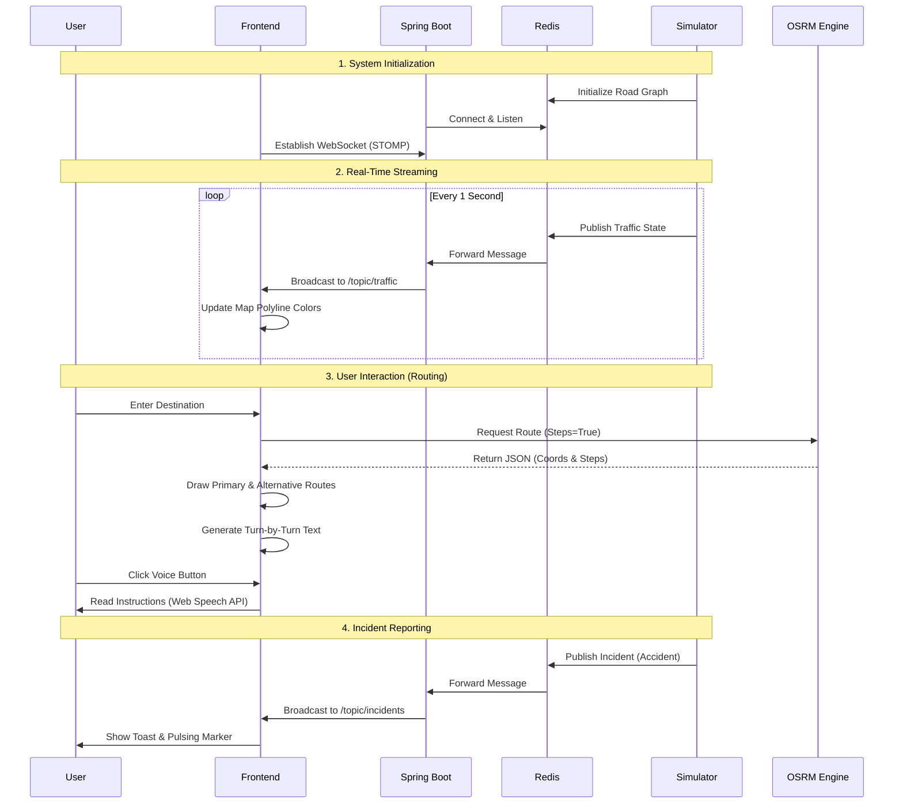

# Application Flow: User Journey & Logic

This document details the end-to-end operational flow of the Real-Time Traffic Simulation application.

## 🔄 Complete Application Cycle

## 🧠 Logic & Algorithms

### 1. Congestion Weighting (Simulator)
The simulator applies a multiplier to road weights based on the system clock:
- **08:00 - 10:00 (Morning Rush)**: 2.5x Weight
- **17:00 - 19:00 (Evening Rush)**: 3.0x Weight
- **22:00 - 05:00 (Night)**: 0.5x Weight

### 2. Route Instruction Generation (Frontend)
Since OSRM raw data lacks human-friendly sentences, the frontend uses a mapping logic:
- `type: turn` + `modifier: left` + `name: ABC St` => **"Turn left onto ABC St"**
- If `name` is missing, it defaults to **"the road"** for better natural language flow.

### 3. Traffic Stats Aggregation
The Backend `/api/traffic/stats` endpoint:
1. Scans all active road states in Redis.
2. Calculates the average congestion percentage across the city.
3. The Frontend polls this and pushes the value into a rolling array to draw the **SVG Sparkline**.

## 🛠 Features Flow

### 📍 Geolocation & History
1. **Use My Location**: Browser API -> Nominatim Reverse Geocoding -> Populate Origin.
2. **Search History**: Successful route fetch -> Save to `localStorage` -> Display in Autocomplete suggestions.

### 🌗 Theme Management
1. **Toggle Click**: Switch CSS variables (Dark/Light colors).
2. **Map Swap**: Update Leaflet TileLayer URL (CartoDB DarkMatter vs Voyager).
