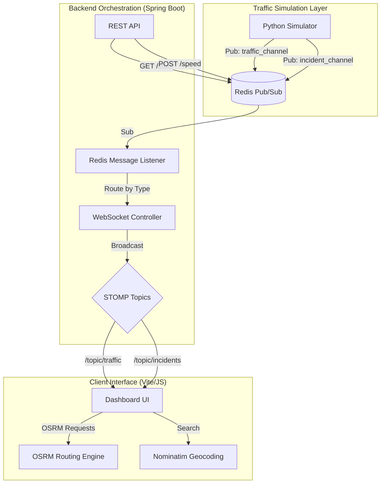

# System Design: Real-Time Traffic Platform

## 🏗 High-Level Architecture

The system follows a reactive, event-driven architecture using a Pub/Sub model for traffic updates and a WebSocket bridge for real-time client synchronization.

## 🧩 Component Breakdown

### 1. Traffic Simulator (Python)
- **Logic**: Models traffic flow based on Dijkstra's algorithm and time-of-day weights (Rush Hour).
- **Concurrency**: Updates multiple road segments simultaneously and pushes state to Redis every second.
- **Incident Engine**: Asynchronously generates road incidents (Accidents, Roadworks) with custom expiry logic.

### 2. Backend Bridge (Java/Spring Boot)
- **Redis Integration**: Uses `StringRedisTemplate` to listen for messages. It acts as a "dumb pipe" for speed but a "smart router" for topic segregation.
- **WebSocket (STOMP)**: Provides a sub-millisecond bridge between Redis and the browser.
- **State Persistence**: Redis acts as the single source of truth for current city congestion levels and simulator settings.

### 3. Frontend Dashboard (HTML5/JS)
- **Rendering Engine**: Leaflet.js with custom SVG path manipulation for traffic lines.
- **Logic Engine**: Manages asynchronous states for routing, autocomplete, and real-time updates.
- **Voice Engine**: Uses the native Web Speech API for low-latency turn-by-turn guidance.

## 📡 Data Flow

1. **Traffic Tick**: Simulator computes congestion -> Redis `traffic_channel` -> Spring Boot -> WebSocket `/topic/traffic` -> UI updates polyline colors.
2. **Incident Broadcast**: Simulator picks random road -> Redis `incident_channel` -> Spring Boot -> WebSocket `/topic/incidents` -> UI shows Toast and Pulsing Marker.
3. **Routing**: User Search -> Geocoding -> OSRM API -> UI draws primary & alt routes -> UI generates instructions -> Voice reads them.
