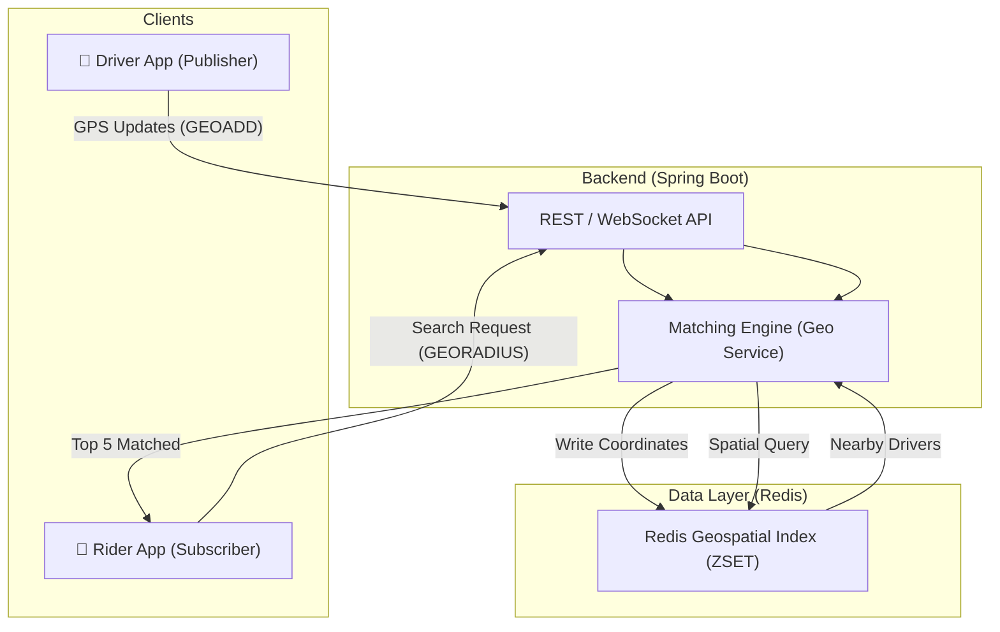
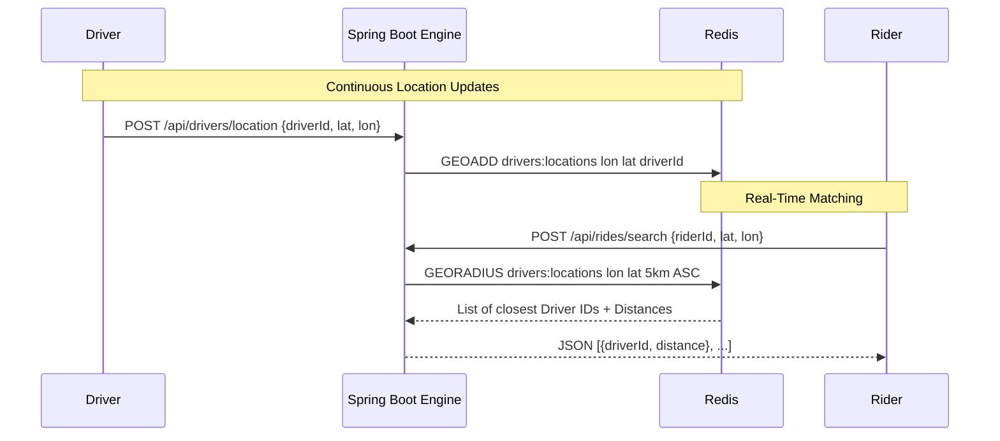

# 🚕 Ride-Sharing Geospatial System Design

## 1. Overview
This system is designed for high-concurrency, real-time matching of riders to the nearest available drivers. Unlike traditional database systems, this architecture prioritizes **spatial query performance** and **low-latency communication**.

## 2. Architecture Diagram

## 3. Core Technologies & Decisions

### 📍 Redis Geospatial (Geohashing)
*   **Decision**: We use Redis `GEO` commands instead of a standard SQL `WHERE lat/long` query.
*   **Why?**: Standard SQL queries with `distance < X` require complex math (Haversine formula) on every row, which is `O(N)`. Redis uses **Geohashing**, which reduces the 2D coordinate into a 1D string, allowing `O(log(N))` search speeds.

### ⚡ Real-Time Ingestion
*   **Flow**: Drivers report their position every 2-5 seconds.
*   **Storage**: We use a Sorted Set (`ZSET`) where the "Score" is the Geohash of the coordinates.

## 4. Matching Sequence Flow

## 5. Scalability Considerations
1.  **Sharding**: For a global scale (e.g., Uber), we would shard Redis by **City ID** or **Geogrid** so that New York drivers aren't in the same index as London drivers.
2.  **Expiration**: Driver locations should have a TTL (Time-To-Live). If a driver goes offline, their pin should disappear from the map automatically to avoid "Ghost Drivers."
3.  **WebSockets**: For the final step, we will move from REST `POST` to **WebSockets** to "push" driver movements to the rider's screen without refreshing.

---
*Generated by Antigravity System Designer*
