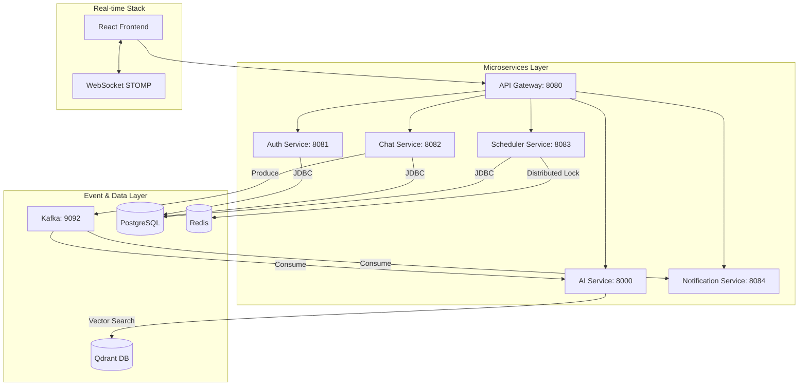

# 🧠 AI-Powered Collaboration Platform


A production-grade, microservices-based collaboration platform designed for high-concurrency real-time communication and AI-driven intelligence. This project demonstrates advanced system design patterns including **Event-Driven Architecture**, **Distributed Locking**, **Semantic Search**, and **Scalable API Gateway Routing**.

---

## 🏗 System Architecture



---

## 🚀 Key Features

### 1. Real-Time Distributed Chat
*   **Protocol**: WebSocket with STOMP sub-protocol for reliable message delivery.
*   **Scalability**: Messages are broadcasted via **Kafka** topics, ensuring that all service instances and notification listeners stay in sync.
*   **Persistence**: PostgreSQL storage with optimized indexing for conversation history.

### 2. AI Meeting Intelligence
*   **Summarization**: Extract key summaries from long meeting transcripts using NLP pipelines.
*   **Action Extraction**: Automatically identify TODOs and decisions from text using keyword-weighted analysis.
*   **Engine**: Built with **FastAPI** and **FastEmbed** (ONNX) for high-performance, CPU-efficient inference.

### 3. Semantic Message Search
*   **Vector Embeddings**: Converts messages into high-dimensional vectors (all-MiniLM-L6-v2).
*   **Vector DB**: Powered by **Qdrant** for sub-millisecond similarity search.
*   **Contextual Queries**: Search for "That discussion about the budget" rather than just keywords.

### 4. Distributed Scheduler
*   **Reliability**: Prevents double-booking using **Redisson** distributed locks (Redlock algorithm).
*   **State Management**: Complex meeting states (Scheduled, In-Progress, Completed) tracked in a dedicated schema.

### 5. Resilient Notifications
*   **Retry Pattern**: Automated retries with exponential backoff for failed delivery attempts.
*   **Fault Tolerance**: Messages that fail all retries are automatically moved to a **Dead Letter Topic (DLT)** for manual recovery.

---

## 🛠 Tech Stack

| Category | Technology |
| :--- | :--- |
| **Backend** | Java 17, Spring Boot 3.2, Python 3.11, FastAPI |
| **Frontend** | React, Vite, Lucide Icons, Vanilla CSS |
| **Messaging** | Apache Kafka (Confluent Platform) |
| **Caching/Locking** | Redis, Redisson |
| **Databases** | PostgreSQL 15, Qdrant (Vector Search) |
| **Containerization**| Docker, Docker Compose |

---

## ⚙️ Getting Started

### Prerequisites
*   Docker & Docker Desktop
*   Java 17+ (for local development)
*   Maven 3.8+
*   Node.js 20+

### Step 1: Start Infrastructure & AI Service
The platform uses a hybrid deployment. Infrastructure and the Python AI service run in Docker for consistency.
```bash
docker-compose up -d postgres redis zookeeper kafka qdrant ai-service
```

### Step 2: Initialize Databases
Wait for Postgres to be healthy, then the `init.sql` script will automatically create `auth_db`, `chat_db`, and `scheduler_db`.

### Step 3: Run Backend Services (Local Hybrid Mode)
Run each service in a separate terminal for easy log monitoring:
```bash
# In each service directory (auth, chat, scheduler, notification, api-gateway):
mvn spring-boot:run
```

### Step 4: Start UI
```bash
cd collab-ui
npm install
npm run dev
```
Access the platform at `http://localhost:5173`.

---

## 🛣 API Entry Points (via Gateway 8080)

| Service | Path | Description |
| :--- | :--- | :--- |
| **Auth** | `/api/v1/auth/**` | User registration, Login, Token validation |
| **Chat** | `/api/v1/chat/**` | Message history, Conversation management |
| **AI** | `/api/v1/ai/**` | Summarization, Embedding, Semantic search |
| **Scheduler**| `/api/v1/scheduler/**`| Meeting booking and calendar management |

---

## 📐 System Design Decisions

1.  **API Gateway**: All external traffic flows through the Spring Cloud Gateway. This provides a single entry point for the UI, enables CORS management, and simplifies security filtering.
2.  **Stateless Auth**: Uses JWT tokens for authentication. The Gateway can validate tokens locally or delegate to the Auth service, ensuring low latency.
3.  **Kafka Orchestration**: The Chat service produces to `chat.messages`. Both the Notification service (for alerts) and the AI service (for search indexing) consume this topic independently, decoupling the systems.
4.  **Redlock Pattern**: To ensure consistency in a distributed environment, the Scheduler uses Redisson locks to guarantee that no two users can book the same slot simultaneously across different service instances.
5.  **FastEmbed Optimization**: Switched from heavy PyTorch models to ONNX-based **FastEmbed** to reduce the AI service container size from 2GB to ~300MB and improve startup speed.

---

## 🤝 Contributing
1.  Fork the repo.
2.  Create your feature branch (`git checkout -b feature/AmazingFeature`).
3.  Commit your changes (`git commit -m 'Add some AmazingFeature'`).
4.  Push to the branch (`git push origin feature/AmazingFeature`).
5.  Open a Pull Request.
