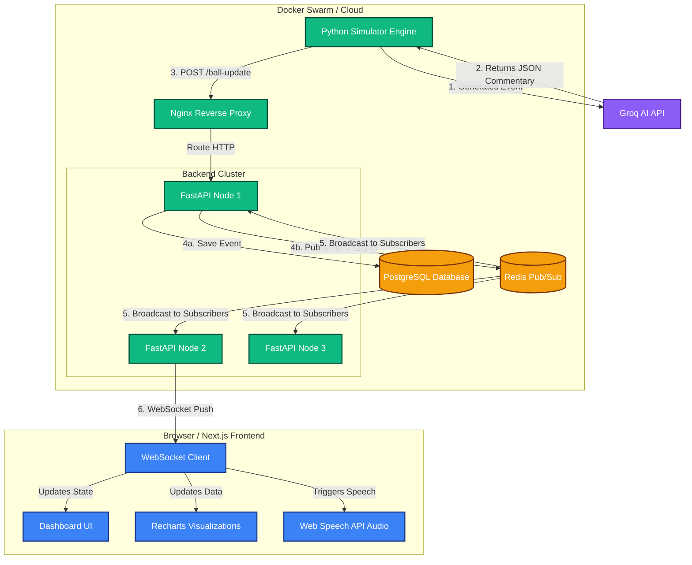

# CricStream: System Design & Architecture

CricStream is a high-performance, real-time cricket scoreboard application designed to handle high-frequency updates, dual-language AI commentary generation, and persistent data storage at scale.

## 1. System Architecture

The system follows an **Event-Driven Microservices Architecture** orchestrated via Docker Compose and ready for Docker Swarm deployments.

### Components:
- **Simulator (Event Producer)**: A Python service that mimics real-world cricket match pacing (12-15s per ball) and uses **Groq AI (Llama-3.3-70b)** to generate simultaneous JSON commentary in English (Ravi Shastri persona) and Hindi (Aakash Chopra persona).
- **Backend (Event Orchestrator)**: A FastAPI async server that:
  - Persists incoming ball events to PostgreSQL using SQLAlchemy/Asyncpg.
  - Publishes events to a Redis Pub/Sub channel.
  - Manages thousands of concurrent WebSocket connections and broadcasts Redis messages to them.
- **Database (Persistence Layer)**: PostgreSQL 15 stores the entire history of matches, players, and events.
- **Redis (Message Broker)**: Facilitates Pub/Sub communication to decouple event ingestion from WebSocket broadcasting.
- **Frontend (Event Consumer)**: A Next.js 14 dashboard providing:
  - Real-time scoreboard UI.
  - Dynamic `recharts` graphical visualizations (Run Rate Progression & Runs Per Over).
  - Client-side Text-to-Speech audio synthesis using the Web Speech API.
- **Reverse Proxy (Load Balancer)**: Nginx handles incoming traffic, serving as a gateway to multiple replicated backend services in production.

---

## 2. Architecture Diagram

---

## 3. System Design Principles Used

### A. Observer Pattern (Pub/Sub)
We use **Redis Pub/Sub** to decouple ingestion from delivery. If 100,000 users are connected across 10 backend nodes, the simulator still only makes exactly **one** API request. Redis efficiently fans out that event to all 10 nodes, which then push to their respective 10,000 WebSocket clients.

### B. CQRS (Command Query Responsibility Segregation) Concept
- **Command (Write)**: The `/ball-update` endpoint handles writes to the Postgres Database.
- **Query (Read/Live)**: The WebSocket connections only handle reading the live broadcasted data from Redis memory, completely bypassing the disk database for real-time delivery, ensuring ultra-low latency. Historical data (`/matches/{match_id}/history`) is fetched from Postgres only on initial load.

### C. Client-Side Rendering Offloading
Heavy operations like calculating chart aggregates and synthesizing human voices are pushed to the client-side (Next.js and Web Speech API). This drastically reduces CPU overhead on the backend, allowing a single FastAPI node to manage exponentially more WebSocket connections.

---

## 4. Scalability Strategies

1. **Backend Horizontal Scaling**: The FastAPI layer is completely stateless. By placing it behind Nginx in a Docker Swarm, we can scale from 1 to 100 replicas (`docker service scale backend=100`) without breaking WebSocket functionality.
2. **Database Connection Pooling**: SQLAlchemy and `asyncpg` use connection pooling to prevent overwhelming PostgreSQL during high-traffic reads.
3. **Redis Clustering**: As Pub/Sub traffic increases, a single Redis instance can be replaced with a Redis Cluster to shard the channels.

---

## 5. Potential Future Enhancements

- **Machine Learning Integration**: Train a model on the historical PostgreSQL data to generate a real-time Win Predictor graph.
- **CDN Edge Delivery**: Serve the Next.js static assets via Vercel or CloudFront to reduce initial load times globally.
- **Authentication**: Add JWT-based Auth to allow users to save their favorite matches or participate in live chat features.
