# 🏏 CricStream — Real-Time Cricket Scoreboard & AI Commentary Engine

> A high-performance, event-driven platform delivering live cricket scores, dual-language AI commentary, and rich data visualizations at scale.

---

## Table of Contents

- [Overview](#overview)
- [Feature Highlights](#feature-highlights)
- [System Architecture](#system-architecture)
  - [Component Breakdown](#component-breakdown)
  - [Architecture Diagram](#architecture-diagram)
  - [Data Flow (End-to-End)](#data-flow-end-to-end)
- [Design Principles](#design-principles)
  - [Observer Pattern via Redis Pub/Sub](#1-observer-pattern-via-redis-pubsub)
  - [CQRS — Separating Writes from Live Reads](#2-cqrs--separating-writes-from-live-reads)
  - [Client-Side Offloading](#3-client-side-offloading)
- [Scalability Strategies](#scalability-strategies)
- [Technology Stack](#technology-stack)
- [Getting Started](#getting-started)
- [Future Roadmap](#future-roadmap)

---

## Overview

CricStream is a full-stack, production-grade application built around a single core challenge: **delivering live cricket match events to potentially hundreds of thousands of concurrent viewers with minimal latency and zero data loss.**

The system is deliberately architected around an **event-driven microservices model** — each component has a single responsibility, communicates asynchronously, and can scale independently. A Python simulator mimics real-world match pacing (one ball every 12–15 seconds), feeds events through a FastAPI backend, and broadcasts them via WebSockets to a Next.js 14 frontend, all orchestrated through Docker Compose (with Docker Swarm support for production deployments).

---

## Feature Highlights

| Feature | Details |
|---|---|
| **Real-Time Scoreboard** | Live ball-by-ball updates via WebSocket connections |
| **Dual-Language AI Commentary** | Simultaneous English (Ravi Shastri persona) & Hindi (Aakash Chopra persona) commentary via Groq AI (Llama-3.3-70b) |
| **Audio Synthesis** | Client-side Text-to-Speech using the Web Speech API — no server-side audio rendering |
| **Live Data Visualizations** | Run Rate Progression & Runs Per Over charts via `recharts` |
| **Persistent Match History** | Full ball-by-ball records stored in PostgreSQL |
| **Horizontal Scaling** | Stateless backend nodes behind Nginx; scale to 100+ replicas with a single command |

---

## System Architecture

CricStream uses an **Event-Driven Microservices Architecture** composed of six distinct layers: a simulator, a backend cluster, a PostgreSQL database, a Redis message broker, a Next.js frontend, and an Nginx reverse proxy.

### Component Breakdown

---

#### 🤖 Simulator — Event Producer

**Technology**: Python  
**Role**: The entry point for all match data.

The simulator is a standalone Python service that replicates real-world cricket match pacing by introducing a 12–15 second delay between balls. For each ball event, it:

1. Constructs the match state (current over, runs, wickets, batting/bowling figures).
2. Sends that state to the **Groq AI API** (Llama-3.3-70b), requesting commentary in **two languages simultaneously** — English in the voice of Ravi Shastri and Hindi in the voice of Aakash Chopra. The response is returned as a structured JSON object.
3. Fires a single HTTP `POST /ball-update` request to the backend with the combined event payload (match data + commentary).

The simulator is intentionally decoupled from the backend. It has no knowledge of database schemas, WebSocket clients, or Redis. It simply produces events.

---

#### ⚡ Backend (FastAPI) — Event Orchestrator

**Technology**: Python, FastAPI, SQLAlchemy, Asyncpg  
**Role**: The central nervous system of the platform.

The FastAPI backend is a fully **async** server with two primary responsibilities upon receiving a ball event:

**4a. Persistence** — The event is written to PostgreSQL via SQLAlchemy and `asyncpg`. This is the authoritative record of the match.

**4b. Broadcasting** — The event is simultaneously published to a **Redis Pub/Sub channel**. This decouples event ingestion from real-time delivery: the simulator makes exactly one API call regardless of how many users are connected.

The backend also maintains **thousands of concurrent WebSocket connections**. Each backend node subscribes to the Redis channel; when an event arrives, it immediately pushes it to all connected WebSocket clients on that node.

A dedicated endpoint (`GET /matches/{match_id}/history`) serves historical ball data from PostgreSQL on initial page load.

---

#### 🗄️ PostgreSQL — Persistence Layer

**Technology**: PostgreSQL 15, SQLAlchemy  
**Role**: Long-term storage for all match, player, and ball event data.

PostgreSQL is the single source of truth for historical data. It is written to on every ball event but is **never queried for real-time delivery** — that path runs exclusively through Redis and WebSockets to eliminate I/O latency from the live data path.

Connection pooling via `asyncpg` prevents connection exhaustion under high load.

---

#### 🔴 Redis — Message Broker

**Technology**: Redis Pub/Sub  
**Role**: Fan-out engine for real-time event delivery.

Redis sits between the backend's ingestion path and its delivery path. When a single ball event is published to the Redis channel, every subscribed backend node (API Node 1, 2, 3...) receives it simultaneously. This enables the system to scale WebSocket connections horizontally across many nodes without any node needing to know about the others.

In production, a Redis Cluster can replace the single instance to shard channels across multiple Redis nodes as Pub/Sub traffic grows.

---

#### 🖥️ Frontend — Event Consumer

**Technology**: Next.js 14, React, Recharts, Web Speech API  
**Role**: The user-facing dashboard.

The Next.js frontend connects to the backend via a persistent WebSocket connection. On each incoming event it:

- Updates the **live scoreboard UI** (runs, wickets, current over, batsman/bowler stats).
- Re-renders **Recharts visualizations**: a Run Rate Progression line chart and a Runs Per Over bar chart, both calculated client-side from the event stream.
- Triggers **audio commentary** via the browser's Web Speech API, synthesizing the AI-generated commentary text into spoken audio without any server round-trip.

Pushing computation (chart aggregation, audio synthesis) to the client significantly reduces CPU load on backend nodes, allowing each node to sustain a far larger number of concurrent WebSocket connections.

---

#### 🔀 Nginx — Reverse Proxy & Load Balancer

**Technology**: Nginx  
**Role**: Traffic gateway.

Nginx sits in front of the backend cluster, routing incoming HTTP and WebSocket traffic across backend replicas. In Docker Swarm mode, new backend nodes are automatically registered and deregistered with Nginx as the cluster scales.

---

### Architecture Diagram

```mermaid
flowchart TD
    subgraph Client-Side [Browser / Next.js Frontend]
        UI[Dashboard UI]
        Charts[Recharts Visualizations]
        Audio[Web Speech API Audio]
        WS_Client[WebSocket Client]
    end

    subgraph Infrastructure [Docker Swarm / Cloud]
        Proxy[Nginx Reverse Proxy]

        subgraph Backend Cluster
            API_1[FastAPI Node 1]
            API_2[FastAPI Node 2]
            API_3[FastAPI Node 3]
        end

        DB[(PostgreSQL Database)]
        Cache[(Redis Pub/Sub)]
        Sim[Python Simulator Engine]
    end

    External_AI[Groq AI API]

    Sim -- 1. Generates Event --> External_AI
    External_AI -- 2. Returns JSON Commentary --> Sim
    Sim -- 3. POST /ball-update --> Proxy

    Proxy -- Route HTTP --> API_1

    API_1 -- 4a. Save Event --> DB
    API_1 -- 4b. Publish to Channel --> Cache

    Cache -- 5. Broadcast to Subscribers --> API_1
    Cache -- 5. Broadcast to Subscribers --> API_2
    Cache -- 5. Broadcast to Subscribers --> API_3

    API_2 -- 6. WebSocket Push --> WS_Client

    WS_Client -- Updates State --> UI
    WS_Client -- Updates Data --> Charts
    WS_Client -- Triggers Speech --> Audio

    classDef frontend fill:#3b82f6,stroke:#1e3a8a,stroke-width:2px,color:#fff
    classDef backend fill:#10b981,stroke:#064e3b,stroke-width:2px,color:#fff
    classDef db fill:#f59e0b,stroke:#78350f,stroke-width:2px,color:#fff
    classDef external fill:#8b5cf6,stroke:#4c1d95,stroke-width:2px,color:#fff

    class UI,Charts,Audio,WS_Client frontend
    class API_1,API_2,API_3,Proxy,Sim backend
    class DB,Cache db
    class External_AI external
```



---

### Data Flow (End-to-End)

Here is the complete lifecycle of a single ball event through the system:

```
┌─────────────────────────────────────────────────────────────────────────┐
│  STEP 1 — Commentary Generation                                         │
│  Simulator builds match state → sends to Groq AI → receives JSON with  │
│  English (Ravi Shastri) + Hindi (Aakash Chopra) commentary             │
└──────────────────────────────┬──────────────────────────────────────────┘
                               │ POST /ball-update
                               ▼
┌─────────────────────────────────────────────────────────────────────────┐
│  STEP 2 — Ingestion & Fan-Out (FastAPI Node 1)                          │
│  ├── 4a. Write event to PostgreSQL (durable storage)                    │
│  └── 4b. Publish event to Redis Pub/Sub channel (broadcast trigger)     │
└──────────────────────────────┬──────────────────────────────────────────┘
                               │ Redis fan-out
                               ▼
┌─────────────────────────────────────────────────────────────────────────┐
│  STEP 3 — WebSocket Broadcast (All Backend Nodes)                       │
│  Every subscribed FastAPI node (1, 2, 3...) receives the Redis message  │
│  and immediately pushes it over WebSocket to all connected clients      │
└──────────────────────────────┬──────────────────────────────────────────┘
                               │ WebSocket push
                               ▼
┌─────────────────────────────────────────────────────────────────────────┐
│  STEP 4 — Client-Side Rendering                                         │
│  ├── Scoreboard UI state updated                                        │
│  ├── Recharts graphs recalculated and re-rendered                       │
│  └── Web Speech API synthesizes commentary audio                        │
└─────────────────────────────────────────────────────────────────────────┘
```

---

## Design Principles

### 1. Observer Pattern via Redis Pub/Sub

The simulator (publisher) and WebSocket clients (observers) are fully decoupled through Redis. The simulator has zero knowledge of how many backend nodes or clients exist — it fires one event; Redis handles fan-out to every subscriber.

**Why this matters at scale**: If 100,000 users are connected across 10 backend nodes, the simulator still makes exactly **one** API call per ball. Redis fans that single event out to all 10 nodes, which each push to their 10,000 clients. Without this pattern, the simulator (or backend ingestion layer) would need to manage 100,000 delivery paths directly.

---

### 2. CQRS — Separating Writes from Live Reads

CricStream applies a CQRS-inspired separation:

- **Command (Write) Path**: `POST /ball-update` → FastAPI → PostgreSQL. Every ball event is durably persisted.
- **Query (Live Read) Path**: WebSocket connections read exclusively from Redis in-memory. They never touch the database during live streaming.
- **Query (Historical Read) Path**: `GET /matches/{match_id}/history` reads from PostgreSQL, but only on initial page load — not during the live stream.

This means the hot path (real-time delivery to thousands of clients) is entirely in-memory and never competes with database I/O.

---

### 3. Client-Side Offloading

Two computationally expensive operations — **chart data aggregation** and **audio synthesis** — are deliberately pushed to the client:

- The browser calculates run rates and per-over aggregates from the raw event stream.
- The Web Speech API synthesizes audio commentary on-device, requiring no backend audio rendering infrastructure.

This design choice means a single FastAPI node's CPU budget is spent almost entirely on WebSocket connection management and Redis subscriptions, not data transformation or media generation — allowing each node to handle exponentially more connections.

---

## Scalability Strategies

| Strategy | Implementation |
|---|---|
| **Stateless Backend** | FastAPI nodes hold no session state; any node can serve any client. Scale with `docker service scale backend=N`. |
| **Horizontal WebSocket Scaling** | Redis Pub/Sub ensures all nodes stay in sync regardless of which node a client connects to. |
| **Database Connection Pooling** | `asyncpg` connection pools prevent PostgreSQL from being overwhelmed during spikes. |
| **Redis Clustering** | Single Redis instance can be swapped for a Redis Cluster to shard channels as Pub/Sub volume grows. |
| **Client-Side Compute** | Chart aggregation and TTS offloaded to the browser, freeing server resources for more connections. |
| **CDN-Ready Frontend** | Next.js static assets are designed for deployment to Vercel or CloudFront for global low-latency delivery. |

---

## Technology Stack

| Layer | Technology |
|---|---|
| **AI Commentary** | Groq API — Llama-3.3-70b |
| **Simulator** | Python |
| **Backend** | FastAPI (async), SQLAlchemy, Asyncpg |
| **Database** | PostgreSQL 15 |
| **Message Broker** | Redis Pub/Sub |
| **Frontend** | Next.js 14, React, Recharts |
| **Audio** | Web Speech API (client-side) |
| **Reverse Proxy** | Nginx |
| **Orchestration** | Docker Compose / Docker Swarm |

---

## Getting Started

```bash
# Clone the repository
git clone https://github.com/your-org/cricstream.git
cd cricstream

# Configure environment
cp .env.example .env
# Add your GROQ_API_KEY to .env

# Start all services
docker compose up --build

# Scale the backend (production)
docker service scale cricstream_backend=5
```

The frontend will be available at `http://localhost:3000`. The FastAPI backend runs at `http://localhost:8000`.

---

## Future Roadmap

- **Win Predictor ML Model** — Train on historical PostgreSQL ball-by-ball data to generate a real-time win probability graph, updated on every delivery.
- **CDN Edge Delivery** — Deploy Next.js static assets to Vercel or CloudFront to minimize time-to-first-byte for global audiences.
- **JWT Authentication** — Allow users to create accounts, save favourite matches, and access personalized match history.
- **Live Chat** — Per-match chat rooms with WebSocket-based messaging, decoupled from the score broadcast channel.
- **Push Notifications** — Wicket and milestone alerts delivered via browser Push API or mobile notifications.
- **Redis Cluster Migration** — Replace single Redis with a production Redis Cluster for horizontal Pub/Sub scaling beyond a single node's throughput ceiling.