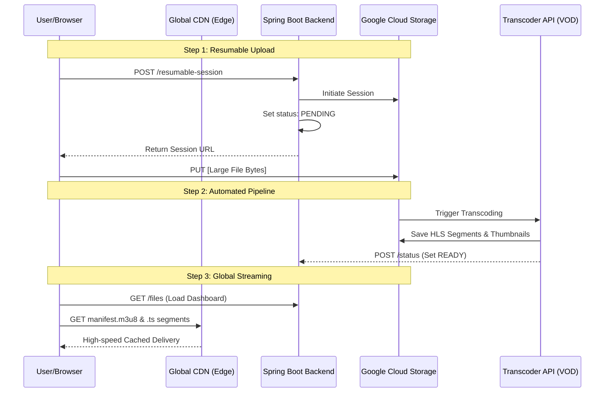

# CloudStream: Secure GCS File Upload System

CloudStream is a production-grade implementation of a Decoupled File Upload System using Google Cloud Storage (GCS), V4 Signed URLs, and PostgreSQL for metadata persistence. This architecture is designed to handle high-traffic file uploads efficiently by offloading data transfer to the cloud while maintaining a robust audit trail in a relational database.

---

## System Design Architecture

The project implements a "Direct-to-Cloud" pattern combined with "Metadata Persistence." Instead of just uploading files, the system now tracks every upload attempt and successful generation of access links in a database.

### Process Flow (Mermaid)



---

## Key System Design Concepts

### 1. Decoupled Data Transfer (Offloading)
The application server never touches the file bytes. This saves bandwidth and CPU, allowing the server to scale horizontally without being bottlenecked by I/O.

### 2. Metadata Persistence (Audit Trail)
Every upload request is logged in PostgreSQL. This allows the system to:
- Track which files were uploaded and when.
- Provide a history/dashboard of uploads to the user.
- Maintain a mapping between the user's original filename and the unique GCS storage name.

### 3. Time-Limited Principle (Least Privilege)
Signed URLs expire in 15 minutes. This minimizes the window of risk if a URL is leaked.

### 4. Adaptive Bitrate Streaming (ABR)
The system automatically transcodes videos into multiple resolutions (720p, 360p). This ensures that a user on a weak mobile network can still watch without buffering while a user on high-speed fiber gets the best quality.

### 5. Global Edge Caching (Cloud CDN)
By using a Global HTTP(S) Load Balancer and Cloud CDN, video data is stored at the edge of Google's network. This reduces the time-to-first-byte (TTFB) significantly and offloads traffic from the primary storage bucket.

---

## Technical Stack

- **Backend**: Java 17, Spring Boot 3.2.4
- **Persistence**: Spring Data JPA, Hibernate, PostgreSQL
- **Cloud Storage**: Google Cloud Storage SDK (V4 Signatures)
- **Frontend**: Vanilla JS (ES6+), HTML5, CSS3 (Glassmorphism design)
- **Auth**: Service Account (JSON Key) with Storage Object Admin roles.

---

## Setup & Installation

### 1. Google Cloud Configuration

#### A. Create a Storage Bucket
1. Navigate to GCS Console.
2. Create a bucket (e.g., tushar-secure-uploads).

#### B. Configure CORS
Apply the following CORS policy to your bucket:
```json
[
  {
    "origin": ["*"],
    "method": ["PUT", "GET", "OPTIONS"],
    "responseHeader": ["Content-Type", "x-goog-resumable"],
    "maxAgeSeconds": 3600
  }
]
```
Command: `gsutil cors set cors.json gs://YOUR_BUCKET_NAME`

### 2. Database Configuration
Ensure you have a PostgreSQL instance running. Create a database named `gcs_db`.

Update `backend/src/main/resources/application.properties`:
```properties
spring.datasource.url=jdbc:postgresql://localhost:5432/gcs_db
spring.datasource.username=your_username
spring.datasource.password=your_password
spring.jpa.hibernate.ddl-auto=update
```

### 3. Service Account
Ensure your Service Account JSON key is available and referenced in the properties file:
```properties
gcp.storage.credentials-path=file:C:/path/to/your/key.json
```

---

## API Endpoints

| Method | Endpoint | Description |
| :--- | :--- | :--- |
| `GET` | `/files/upload-url` | Generates a signed PUT URL and saves metadata. |
| `GET` | `/files/download-url` | Generates a signed GET URL for viewing. |
| `GET` | `/files` | Lists all uploaded file metadata from the database. |

---

## Security Considerations

- **V4 Signature Validation**: The signed URL is locked to a specific `Content-Type`. If the client tries to upload a different type, GCS will reject it.
- **Relational Integrity**: The database ensures that every GCS object has a corresponding metadata record, facilitating easier cleanup and management.
- **Environment Isolation**: Sensitive configuration (DB passwords, Cloud Keys) is kept in properties files, allowing for easy environment-specific overrides.

## Engineering Lessons and Troubleshooting

This project served as a deep dive into the practicalities of cloud-native development. Below are the key logical concepts and troubleshooting steps encountered.

### 1. Direct-to-Cloud Logic (Signed URLs)
**Logic:** By offloading the file upload to GCS, we prevent our Spring Boot server from being a bottleneck. The backend acts only as an **authorizer** (generating the URL) and an **auditor** (saving metadata to Cloud SQL).

### 2. Serverless AI Data Pipeline (Gemini 2.5 Flash)
**Logic:** The system is a production-grade Video-on-Demand (VOD) and AI data pipeline. It is divided into three main components:
1. **Backend (Spring Boot):** Manages metadata, signed URLs, and summarization retrieval.
2. **Frontend (Vanilla JS/CSS):** Premium user dashboard with adaptive player and seek previews.
3. **Cloud Functions (Python):** Event-driven workers for AI summarization and VOD transcoding.

### 📂 Project Structure
```text
Global-Enterprise-VOD-Platform/
├── backend/            # Spring Boot REST API
├── frontend/           # UI & Video Player logic
└── cloud-functions/    # Python workers (Transcoding & Gemini AI)
```
- **The Workflow:** GCS (Upload) -> Eventarc (Trigger) -> Cloud Function (Processing) -> Vertex AI (Gemini 2.5 Flash) -> GCS (Storage).
- **Advanced Feature:** Implemented **[Resumable Uploads](./RESUMABLE_UPLOADS.md)** for high-reliability file ingestion.
- **Lesson - Service Agent Provisioning:** When first connecting Vertex AI to GCS, Google needs a few minutes to provision internal "Service Agents." Attempts during this time will return a `400` error.
- **Lesson - Resource Allocation:** AI libraries (Vertex AI SDK) and PDF processing are memory-intensive. We had to increase the function RAM from `256MiB` to `512MiB` to prevent `OOM (Out of Memory)` crashes.
- **Lesson - Model Selection:** We utilized **Gemini 2.5 Flash**, leveraging its high-speed context processing for instant document summarization.

### 3. Database Migration (Local to Cloud SQL)
- **The Switch:** We moved from a local PostgreSQL to **Google Cloud SQL** (PostgreSQL).
- **Connectivity:** Used the `spring-cloud-gcp-starter-sql-postgresql` connector which manages the secure socket connection using the Cloud SQL Auth Proxy logic under the hood.

### 4. Security & Git Protection
- **Push Protection:** GitHub blocked our push when a Service Account `.json` was detected.
- **Resolution:** We had to remove the secret from the Git index, update `.gitignore`, and **amend the commit** to wipe the history. This ensures that even if the code is public, the credentials were never leaked.

### 6. Adaptive Bitrate (ABR) Troubleshooting
- **Codec Nesting:** Learned that `height_pixels` and `bitrate_bps` must be nested inside the `h264` codec block in the Transcoder API configuration.
- **Hls.js Fallback:** Implemented a native fallback for Safari/iOS while using Hls.js for Chrome/Firefox to ensure cross-browser compatibility.

### 7. Cloud CDN Setup
- **Load Balancer Integration:** Discovered that Cloud CDN requires a Global HTTP(S) Load Balancer to function; it cannot be enabled on a raw GCS bucket alone.
- **Cache Hit Verification:** Learned to use the `X-Cache` and `Age` response headers to verify if content is actually being served from the edge.

---
Created as a System Design Practical Project.
