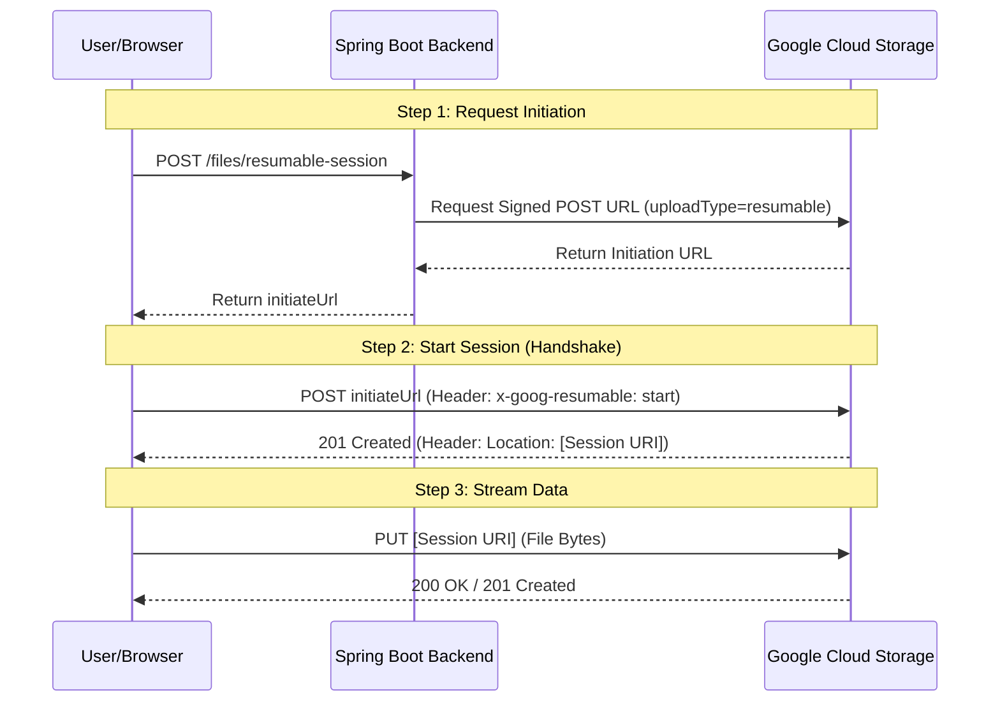

# Deep Dive: Resumable Uploads with GCS

This document explains the architecture and implementation of the **Resumable Upload** feature in the CloudStream system. This pattern is the industry standard for handling large files (GB+) and ensuring reliability in unstable network conditions.

---

## 1. Why Resumable?

In a standard `PUT` upload, the entire file is sent in a single HTTP request. If the connection drops at 99%, the entire upload fails and must be restarted. 

**Resumable Uploads** solve this by:
- **Chunking Support:** Breaking files into parts (optional but supported).
- **Session Persistence:** GCS maintains the state of the upload on their side.
- **Fault Tolerance:** If a connection is lost, the client can query GCS for the last byte received and resume from there.

---

## 2. The Architecture (2-Step Handshake)

Unlike simple signed URLs, resumable uploads require a "handshake" before data transfer starts.

### Flow Diagram



---

## 3. Backend Implementation

The backend generates a **Signed POST URL** with a specific query parameter: `uploadType=resumable`.

```java
// Logic in GcsService.java
Map<String, String> extensionHeaders = new HashMap<>();
extensionHeaders.put("x-goog-resumable", "start");

URL signedUrl = storage.signUrl(blobInfo,
        expiryMinutes, TimeUnit.MINUTES,
        Storage.SignUrlOption.httpMethod(HttpMethod.POST),
        Storage.SignUrlOption.withExtHeaders(extensionHeaders),
        Storage.SignUrlOption.withV4Signature(),
        Storage.SignUrlOption.withQueryParams(Map.of("uploadType", "resumable")));
```

---

## 4. Frontend Implementation

The frontend must perform two distinct XHR/Fetch calls:
1. **Initiation:** Send a `POST` to the signed URL to "open" the session.
2. **Transfer:** Extract the `Location` header from the response and use it as the target for the `PUT` request.

```javascript
// Step 1: Initiate
const xhrInit = new XMLHttpRequest();
xhrInit.open("POST", initiateUrl);
xhrInit.setRequestHeader("x-goog-resumable", "start");

xhrInit.onload = () => {
    const sessionUrl = xhrInit.getResponseHeader("Location");
    // Step 2: Upload
    const xhrUpload = new XMLHttpRequest();
    xhrUpload.open("PUT", sessionUrl);
    xhrUpload.send(file);
};
```

---

## 5. Critical CORS Configuration

Resumable uploads fail in browsers if CORS is not perfectly configured. The browser needs to interact with custom headers and the `Location` header.

### Required Settings:
- **Methods:** `PUT`, `POST`, `OPTIONS`.
- **Response Headers (Expose Headers):**
    - `Location`: Required to read the Session URI.
    - `x-goog-resumable`: Required for the handshake protocol.
- **Origin:** Should be restricted to your domain in production.

---

## 6. Engineering Lessons

1. **The Location Header Mystery:** Many developers forget that `Location` is a protected header. Browsers will refuse to let Javascript read it unless `Access-Control-Expose-Headers` includes it.
2. **Database State:** We save the metadata in the database *before* the upload starts with a `PENDING` status. This allows us to track abandoned uploads and clean up orphans later.
3. **Progress Tracking:** Even with resumable sessions, standard XHR `onprogress` events work perfectly for the UI progress bar.

---
Created as part of the System Design Practical Projects.
